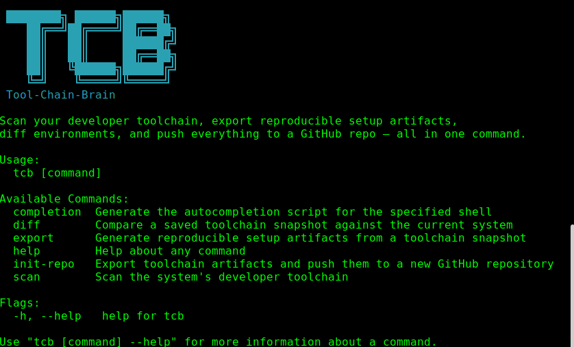

# 🧠 Tool-Chain-Brain

> Scan your developer toolchain. Export it. Replicate it anywhere.

`tcb` is a single Go binary that snapshots every tool in your developer environment — language runtimes, package managers, version managers, infra tooling, git config, shell, and editor — and turns that snapshot into a set of reproducible artifacts you can commit to GitHub, share with a team, or spin up inside a container.

---
<p align="center">

</p>
## Features

- **Full-suite scanner** — 60+ tools across languages, package managers, version managers, and infra/DevOps tooling
- **Four output formats** — `toolchain.yaml` manifest, `setup.sh` idempotent install script, `Dockerfile.devenv`, and `.devcontainer/devcontainer.json`
- **Diff engine** — compare any saved snapshot against your live system or another snapshot; CI-friendly exit codes
- **GitHub integration** — one command creates a repo, generates all artifacts, and pushes everything
- **Cross-platform** — Linux, macOS (Intel + Apple Silicon), Windows

---

## Installation

### Homebrew (macOS / Linux)
```sh
brew install tool-chain-brain/tap/tcb
```

### go install
```sh
go install github.com/guiperry/tool-chain-brain/tcb/cmd/tcb@latest
```

### Build from source
```sh
git clone https://github.com/guiperry/tool-chain-brain/tcb

cd tcb

go mod tidy         # downloads go dependencies

make install        # builds and copies tcb to $(go env GOPATH)/bin
```

### Direct binary download
Grab the latest release for your platform from the [Releases page](https://github.com/guiperry/tool-chain-brain/tcb/releases).

---

## Commands

### `tcb scan`

Probe every tool on the system and write `toolchain.yaml`.

```
tcb scan [flags]

Flags:
  -o, --output string   Directory to write toolchain.yaml (default ".")
      --dry-run         Print summary without saving
  -q, --quiet           Only print the saved file path (scriptable)
```

**Example output:**

```
  🧠 Tool-Chain-Brain Scan Results
  ━━━━━━━━━━━━━━━━━━━━━━━━━━━━━━━━━━━
  Host:                  guillermo-mbp
  Platform:              darwin/arm64
  ━━━━━━━━━━━━━━━━━━━━━━━━━━━━━━━━━━━
  ✓ Language runtimes       8 found
  ✓ Package managers        11 found
  ✓ Version managers        4 found
  ✓ Infra / DevOps tools    14 found

  ✓ Saved → ./toolchain.yaml
```

---

### `tcb export`

Generate all reproducible artifacts from a scan (or an existing `toolchain.yaml`).

```
tcb export [flags]

Flags:
  -o, --output string   Output directory (default "./tcb-export")
  -i, --input string    Load existing toolchain.yaml instead of scanning
      --no-yaml         Skip toolchain.yaml
      --no-setup-sh     Skip setup.sh
      --no-dockerfile   Skip Dockerfile.devenv
      --no-devcontainer Skip .devcontainer/devcontainer.json
```

**Example:**
```sh
# Scan and export everything
tcb export -o ./my-toolchain

# Re-export from a saved snapshot without re-scanning
tcb export -i ./toolchain.yaml -o ./my-toolchain

# Export only the Dockerfile and devcontainer
tcb export --no-yaml --no-setup-sh
```

**Output files:**

| File | Purpose |
|---|---|
| `toolchain.yaml` | Full machine-readable snapshot |
| `setup.sh` | Idempotent bash installer — safe to re-run |
| `Dockerfile.devenv` | Ubuntu-based dev image reproducing the environment |
| `.devcontainer/devcontainer.json` | VS Code Dev Containers config |

---

### `tcb diff`

Compare a saved snapshot against the live system (or another snapshot).

```
tcb diff <toolchain.yaml> [flags]

Flags:
  --current string   Compare against another toolchain.yaml instead of live scan

Exit codes:
  0  No differences
  1  Differences found
  2  Error
```

**Example:**
```sh
# Diff saved snapshot vs current system
tcb diff ./toolchain.yaml

# Diff two saved snapshots (e.g. two team members)
tcb diff alice-toolchain.yaml --current bob-toolchain.yaml
```

**Example output:**

```
  🧠 Tool-Chain-Brain Diff
  ━━━━━━━━━━━━━━━━━━━━━━━━━━━━━━━━━━━
  Saved:   ./toolchain.yaml
  Current: live system scan
  ━━━━━━━━━━━━━━━━━━━━━━━━━━━━━━━━━━━

  ➕  Added (1)
     +  bun                   1.0.25          [languages]

  🔄  Changed (2)
     ~  go                    1.21.0    → 1.22.1    [languages]
     ~  terraform             1.6.5     → 1.7.0     [infra_tools]
```

**Use in CI** — fail a pipeline if the environment drifts from a pinned snapshot:
```yaml
# .github/workflows/env-check.yml
- name: Check toolchain drift
  run: tcb diff toolchain.yaml  # exits 1 if drift detected
```

---

### `tcb init-repo`

Scan, export, and push everything to a new (or existing) GitHub repository.

```
tcb init-repo [flags]

Flags:
      --token string   GitHub personal access token (or set GITHUB_TOKEN)
      --repo string    Repository name (default: toolchain-<hostname>)
      --private        Create as a private repository
  -i, --input string   Load existing toolchain.yaml instead of scanning
      --skip-scan      Use toolchain.yaml in the current directory
```

**Requires** a GitHub personal access token with `repo` scope. Create one at
`github.com/settings/tokens`.

**Example:**
```sh
# Scan and push to github.com/<you>/toolchain-<hostname>
GITHUB_TOKEN=ghp_... tcb init-repo

# Custom repo name, private
tcb init-repo --repo my-dev-env --private --token ghp_...

# Push an existing snapshot without re-scanning
tcb init-repo --input ./toolchain.yaml
```

**Step output:**

```
  🧠 Tool-Chain-Brain → GitHub
  ━━━━━━━━━━━━━━━━━━━━━━━━━━━━━━━━━━━
  ✓ Scanning toolchain…
  ✓ Generating artifacts…
  ✓ Writing README.md…
  ✓ Authenticating with GitHub…
  ✓ Creating repo guillermo/toolchain-mbp…
  ✓ Uploading artifacts…
  ━━━━━━━━━━━━━━━━━━━━━━━━━━━━━━━━━━━

  🚀 Repository ready: https://github.com/guillermo/toolchain-mbp
```

---

## What Gets Scanned

### Languages
Go, Node.js, Python 3, Ruby, Rust, Java, PHP, .NET, Swift, Kotlin, Scala, Elixir, Deno, Bun, Zig, Lua, Perl, Dart

### Package Managers
npm, yarn, pnpm, pip, pip3, pipx, poetry, uv, cargo, gem, bundler, Maven, Gradle, Composer, Homebrew, apt, dnf, pacman, mix, NuGet, Conan, vcpkg

### Version Managers
nvm, volta, fnm, pyenv, rbenv, rvm, asdf, mise, SDKMAN, rustup, goenv, jenv

### Infrastructure & DevOps
Docker, docker-compose, Podman, nerdctl, kubectl, Helm, Minikube, k3s, kind, Terraform, OpenTofu, Pulumi, Ansible, Packer, Vault, AWS CLI, gcloud, Azure CLI, doctl, GitHub CLI, make, just, Task, Bazel, CMake, act

### Git Config
Version, user name/email, default branch, signing key, GPG signing, core editor, autocrlf, pull.rebase, push.default, credential helper

### Shell
Active shell + version, config files (`.zshrc`, `.bashrc`, etc.), 20+ dev-relevant environment variables, full `$PATH`

### Editor
VS Code (version + all installed extensions), `.editorconfig` detection

---

## `toolchain.yaml` Format

```yaml
# Tool-Chain-Brain snapshot
meta:
  scanned_at: 2026-03-14T20:11:00Z
  hostname: guillermo-mbp
  os: darwin
  arch: arm64
  username: guillermo
  tcb_version: 1.0.0

languages:
  - name: go
    version: "1.22.1"
    path: /usr/local/go/bin/go
  - name: node
    version: "20.11.0"
    path: /Users/guillermo/.nvm/versions/node/v20.11.0/bin/node

package_managers:
  - name: npm
    version: "10.2.4"
    path: /usr/local/bin/npm

version_managers:
  - name: nvm
    path: /Users/guillermo/.nvm
    extra:
      nvm_dir: /Users/guillermo/.nvm

infra_tools:
  - name: docker
    version: "24.0.7"
    path: /usr/local/bin/docker
  - name: kubectl
    version: "1.28.3"
    path: /usr/local/bin/kubectl

git:
  version: "2.43.0"
  user_name: Guillermo
  user_email: guillermo@example.com
  default_branch: main
  pull_rebase: "false"
  push_default: current

shell:
  shell: /bin/zsh
  version: "5.9"
  config_files:
    - /Users/guillermo/.zshrc
  env_vars:
    GOPATH: /Users/guillermo/go
    NVM_DIR: /Users/guillermo/.nvm

editor:
  vscode:
    version: "1.85.1"
    extensions:
      - golang.go@0.39.1
      - esbenp.prettier-vscode@10.1.0
```

---

## Development

```sh
# Clone
git clone https://github.com/guiperry/tool-chain-brain/tcb && cd tcb

# Install dependencies
make deps

# Build (current platform)
make build

# Build all platforms
make build-all

# Run a scan immediately
make run

# Run tests
make test

# Format + vet
make fmt && make vet

# Dry-run release (goreleaser, no publish)
make release-dry
```

Full list of targets:

```
make help
```

### Project Layout

```
tool-chain-brain/
├── cmd/tcb/               # Cobra CLI entry point + commands
│   ├── main.go            # Root command + wiring
│   ├── scan.go            # tcb scan
│   ├── export.go          # tcb export
│   ├── diff.go            # tcb diff
│   └── initrepo.go        # tcb init-repo
├── internal/
│   ├── scanner/           # All system probing logic
│   │   ├── scanner.go     # Orchestrator
│   │   ├── languages.go   # 18 language runtimes
│   │   ├── packagemanagers.go
│   │   ├── versionmanagers.go
│   │   ├── infra.go       # 30+ infra/DevOps tools
│   │   ├── git.go
│   │   ├── shell.go
│   │   ├── editor.go
│   │   └── util.go
│   ├── export/            # Artifact generators
│   │   ├── yaml.go
│   │   ├── setup_sh.go
│   │   ├── dockerfile.go
│   │   └── devcontainer.go
│   ├── diff/              # Diff engine
│   │   └── diff.go
│   └── github/            # GitHub API client
│       └── repo.go
├── pkg/models/            # Shared data types
│   └── toolchain.go
├── Makefile
├── .goreleaser.yaml
└── go.mod
```

---

## License

MIT — see [LICENSE](LICENSE).
